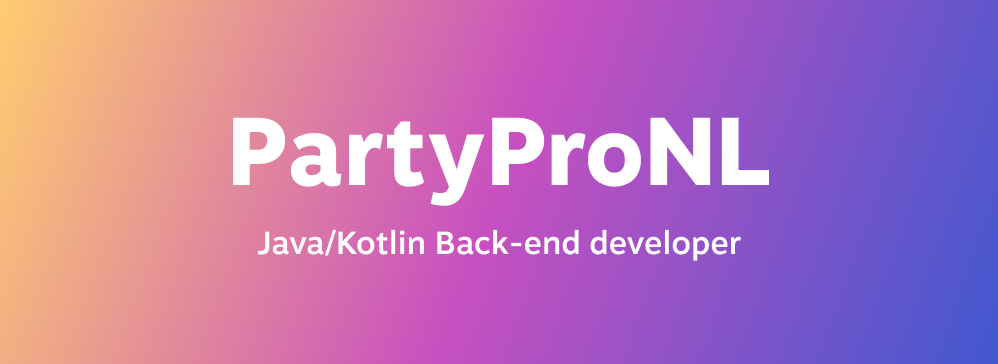

I'm Youri (also known as PartyProNL), a working student at Framna developing Android apps with Kotlin Multiplatform. Currently also studying at the Amsterdam University of Applied Sciences, working on a Bachelor's degree in Software Engineering

Besides Android apps I've also developed websites, back-ends and more. You can find some of my projects below or visit my portfolio at [https://www.yourischeepers.com/](https://www.yourischeepers.com/).
